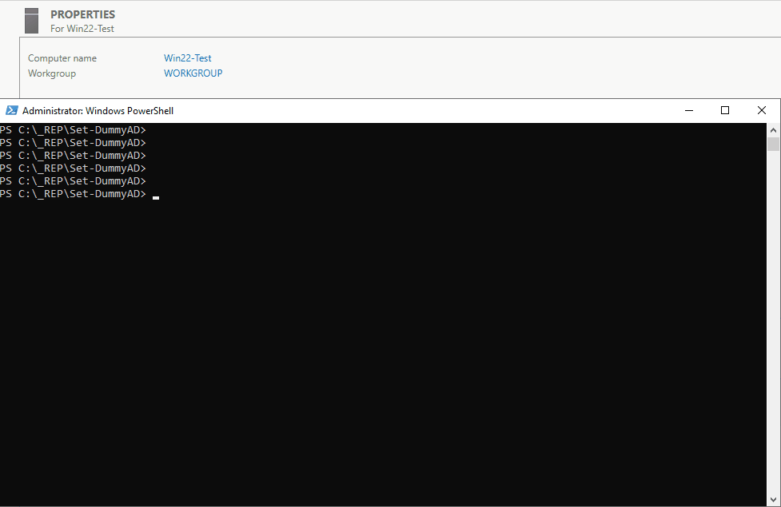
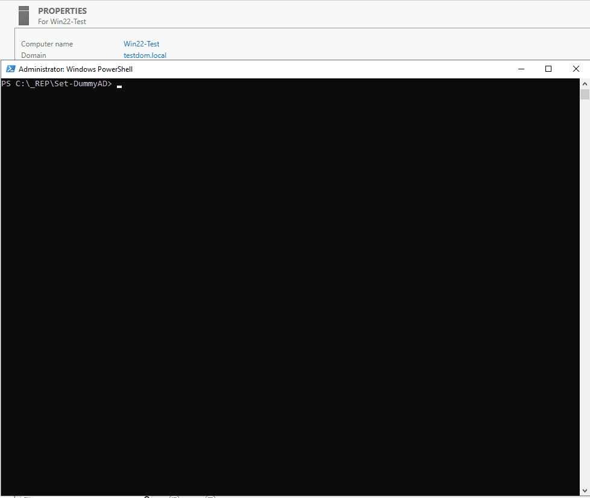

# Set-DummyAD

> Yes, I like my scripts with a verbose output.

See [Demos](#demos)

This is a powershell script to quickly setup an AD environment. With random user names and descriptions. The structure of the AD is defined in `model.json`, see below for possible customization. You have to run this script twice if you want to install ADDS **and** populate the AD with dummy content.

# Context

During my sysadmin formation I wanted to have a script to populate an Active Directory with dummy content.

The content generated comes from the `model.json` (structure of the AD), and the `names.csv` (user names).
- It follows some best practices (GGS, DLGS, Share rights), and some design I find clean (everything what's not `Microsoft BuiltIn` in a `_ROOT` OU)
- What this script will do:
    - Install ADDS roles if not already installed
    - Generate OUs (following model.json)
    - Generate one OU per Department
    - Generate 5 security groups (3 GGS et 2 DLGS) per Department
    - Create one share per Department (managers have RW while users have only RO)
    - Generate one manager per Department (random from 1000names.csv)
    - Generate X users per Department (random from 1000names.csv, X defined in model.json)

# Usage

1. On a windows server as administrator (tested on DataCenter2022)
2. `Set-ExecutionPolicy -ExecutionPolicy RemoteSigned` - if necessary
3. Download & extract the latest [release](https://github.com/BOAScripts/Set-DummyAD/releases/latest) `.zip` file 
4. cd into the downloaded folder
5. Review `model.json`
6. `.\set-DummyAD.ps1`

# Demos

## ADDS installation

## Populate AD with dummy content

# Warnings

- All the users will have `Test1234=` as their password. (customizable in model.json)  
- If ADDS role is installed with this script the DSRM password is also `Test1234=` (uses the same password in model.json)
- This script is not for a production environment but a for a quick setup of an AD lab.

# Customization

## CSV file

1. CSV file name should be `names.csv`
2. The CSV delimiter should be `;`, verify with notepad if necessary.
3. Make sure there is no duplicates, nor weird characters (I do not sanitize those names)
4. Make sure there is enough data to populate the AD ((1 + $UsersPerDept) * $nbrOfDepts should be greater than $nbrOfUsersInCSV)

## model.json

> do not rename the file

|Key|Expected values|
|-|-|
|PSW|`string` - should be compliant with AD password policy|
|PreventOUDeletion|`0` or `1` to disable ot enable it|
|RootOUName|`string`|
|CustomOUs| array of `string` see [Customize the OUs](#customize-the-ous)|
|RootShareName|`string` - the name the directory that all the shared folder will be|
|RootSharePath|`string` - the `\\` is normal in a json file, should be consistent with `RootShareName`|
|Depts|`dictionary` - key:value pairs of `DeptFullName:DeptShortName`|
|AdditionalDesc|array of `string`|
|UsersPerDept|`integer` - number of users per department|

## Customize the OUs

You can customize the OUs but:
- My script can't go deeper (:sadge:) than 2 levels
    - eg: "Computers/Servers" => OK
    - eg: "Computers/Server/001" => NOK
- Make sure you define the parent OU BEFORE the child OU in the list. Or the child OU generation will throw an error because the parent doesn't exist.
- Please don't remove the `Groups` entries, as I use them to generate the security groups
- Please don't remove the `Users` entry, as I use it to generate the users under it.

# Thanks to 

- [MCG](https://www.mcg.be/en)
- [Technobel](https://www.technobel.be/fr/)
